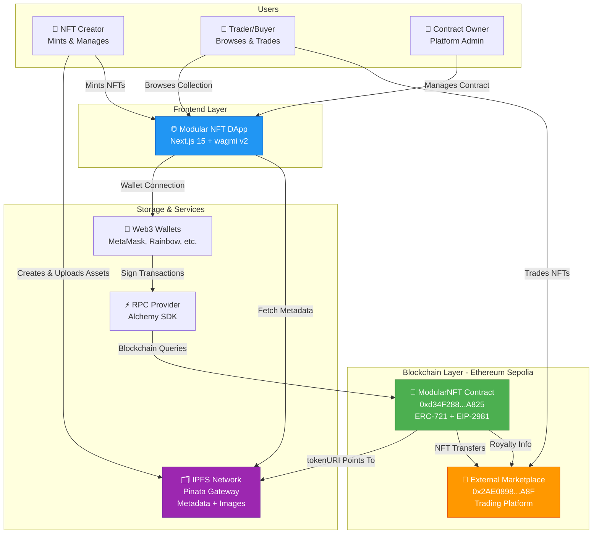

# Modular NFT

> Complete Web3 NFT collection platform - ERC-721 smart contracts + Next.js frontend

## System Architecture

## Features

**Smart Contract (ModularNFT.sol)**
- ✅ ERC-721 standard with Enumerable + URIStorage
- ✅ EIP-2981 royalty system (5% default)
- ✅ Owner & public minting (batch support)
- ✅ Configurable parameters (price, supply, base URI)
- ✅ Secure withdrawal mechanisms

**Frontend (Next.js 15)**
- ✅ Multi-wallet support (RainbowKit)
- ✅ Real-time NFT collection display
- ✅ Advanced filtering (rarity, owner, search)
- ✅ Admin panel for contract owners
- ✅ IPFS integration with gateway fallbacks

## Quick Start

See **[Quick Start Guide](docs/guides/QUICK_START.md)**

## Documentation

- 📖 **[Complete Documentation](docs/)** - Full technical documentation
- 🏗️ **[System Overview](docs/architecture/SYSTEM_OVERVIEW.md)** - Architecture details
- 📜 **[Contract API](docs/smart-contracts/CONTRACT_API.md)** - Smart contract reference
- 🚀 **[Deployment Guide](docs/deployment/DEPLOYMENT_GUIDE.md)** - Deploy to any network
- 🎨 **[NFT Pipeline](docs/nft-assets/NFT_ASSET_PIPELINE.md)** - Asset creation workflow

## Current Deployment

**Network**: Ethereum Sepolia Testnet
**Contract**: `0xd34F288Fa68b657926989EF286477E9f3C87A825`
**Verified**: [View on Etherscan](https://sepolia.etherscan.io/address/0xd34F288Fa68b657926989EF286477E9f3C87A825)

**External Marketplace**: `0x2AE08980761CB189DA6ca1f89fffD0C6DAD65a8F`
**Frontend**: [modular-marketplace.vercel.app](https://modular-marketplace.vercel.app/marketplace)

See [docs/deployment/CONTRACT_ADDRESSES.md](docs/deployment/CONTRACT_ADDRESSES.md) for complete addresses.

## Collection: Crypto Code Doodles

- **Total**: 10 unique NFTs (100 max supply)
- **Rarity**: Common (40%), Rare (30%), Epic (20%), Legend (10%)
- **Theme**: Coding-themed digital art
- **Royalty**: 5% creator royalty (EIP-2981)

## Tech Stack

**Smart Contract**: Solidity 0.8.20 | Foundry | OpenZeppelin 4.9.3
**Frontend**: Next.js 15 | wagmi v2 | RainbowKit | TailwindCSS
**Storage**: IPFS/Pinata
**Infrastructure**: Alchemy RPC | Vercel

---

**Built using Foundry, Next.js, and modern Web3 technologies.**
