# System Overview

> **Part of**: Modular NFT Documentation
> **Related**: [Technical Architecture](TECHNICAL_ARCHITECTURE.md) | [Frontend Architecture](FRONTEND_ARCHITECTURE.md)

## Introduction

Modular NFT is a production-ready Web3 NFT collection platform consisting of an ERC-721 smart contract deployed on Ethereum Sepolia, a Next.js frontend application, and integration with decentralized storage (IPFS) and an external marketplace for NFT trading.

This document provides a high-level overview of the system architecture, key components, and their interactions.

## System Architecture Diagram

```mermaid
graph TB
    subgraph "Users"
        Creator[👤 NFT Creator<br/>Mints & Manages]
        Trader[👤 Trader/Buyer<br/>Browses & Trades]
        Admin[👔 Contract Owner<br/>Platform Admin]
    end

    subgraph "Frontend Layer"
        DApp[🌐 Modular NFT DApp<br/>Next.js 15 + wagmi v2<br/>https://your-app.vercel.app]
    end

    subgraph "Blockchain Layer - Ethereum Sepolia"
        ModularNFT[📜 ModularNFT Contract<br/>0xd34F288...A825<br/>ERC-721 + EIP-2981]
        ExtMarket[🏪 External Marketplace<br/>0x2AE0898...A8F<br/>Trading Platform]
    end

    subgraph "Storage & Services"
        IPFS[🗂️ IPFS Network<br/>Pinata Gateway<br/>Metadata + Images]
        RPC[⚡ RPC Provider<br/>Alchemy SDK<br/>Blockchain Queries]
        Wallet[👛 Web3 Wallets<br/>MetaMask, Rainbow, etc.<br/>RainbowKit]
    end

    Creator -->|Creates & Uploads Assets| IPFS
    Creator -->|Mints NFTs| DApp
    Trader -->|Browses Collection| DApp
    Trader -->|Trades NFTs| ExtMarket
    Admin -->|Manages Contract| DApp

    DApp -->|Wallet Connection| Wallet
    Wallet -->|Sign Transactions| RPC
    RPC -->|Blockchain Queries| ModularNFT

    DApp -->|Fetch Metadata| IPFS
    ModularNFT -->|tokenURI Points To| IPFS

    ModularNFT -->|NFT Transfers| ExtMarket
    ModularNFT -->|Royalty Info| ExtMarket

    style ModularNFT fill:#4CAF50,stroke:#2E7D32,color:#fff
    style DApp fill:#2196F3,stroke:#1565C0,color:#fff
    style ExtMarket fill:#FF9800,stroke:#E65100,color:#fff
    style IPFS fill:#9C27B0,stroke:#6A1B9A,color:#fff
```



## Key Components

### 1. Smart Contract Layer

**ModularNFT Contract** (`0xd34F288Fa68b657926989EF286477E9f3C87A825`)

- **Standard**: ERC-721 (NFT standard) with Enumerable and URIStorage extensions
- **Royalties**: EIP-2981 compliant (5% default creator royalty)
- **Network**: Ethereum Sepolia Testnet (Chain ID: 11155111)
- **Features**:
  - Owner minting (free for contract owner)
  - Public minting (0.01 ETH on Sepolia)
  - Batch minting for gas efficiency
  - Configurable parameters (price, supply, minting status)
  - Emergency withdrawal functions

**External Marketplace Contract** (`0x2AE08980761CB189DA6ca1f89fffD0C6DAD65a8F`)

- **Purpose**: Secondary market trading for Modular NFT collection
- **Features**: Listing, buying, selling with automatic royalty enforcement
- **Integration**: ModularNFT owners approve marketplace for transfers
- **Frontend**: [modular-marketplace.vercel.app/marketplace](https://modular-marketplace.vercel.app/marketplace)

### 2. Frontend Layer

**Modular NFT DApp** (Next.js 15 Application)

- **Framework**: Next.js 15 with App Router
- **Web3 Integration**: wagmi v2 + viem + RainbowKit
- **Key Features**:
  - Wallet connection (MetaMask, WalletConnect, Coinbase, etc.)
  - Real-time NFT collection display
  - Advanced filtering (rarity, ownership, search)
  - Minting interface (public + owner mint)
  - Admin panel (owner-only functions)
  - IPFS metadata and image loading

### 3. Storage Layer

**IPFS (InterPlanetary File System)**

- **Provider**: Pinata Cloud
- **Primary Gateway**: `https://gateway.pinata.cloud/ipfs/`
- **Fallback Gateways**:
  - `https://ipfs.io/ipfs/`
  - `https://cloudflare-ipfs.com/ipfs/`
  - `https://dweb.link/ipfs/`
- **Stored Data**:
  - NFT images (1024x1024px PNG)
  - Metadata JSON files (ERC-721 standard)
  - Collection attributes

### 4. Infrastructure Services

**RPC Provider** (Alchemy)

- **Purpose**: Blockchain query and transaction submission
- **Networks**: Sepolia testnet, Ethereum mainnet (future)
- **Features**: Enhanced APIs, WebSocket support, high uptime

**Web3 Wallets**

- **Integration**: RainbowKit for unified wallet connection
- **Supported**: MetaMask, WalletConnect, Coinbase Wallet, Rainbow, and more
- **Function**: Transaction signing, address management

## User Roles & Interactions

### NFT Creator

**Responsibilities**:
1. Create digital artwork (using tools like Nano Banana)
2. Export to PNG (1024x1024px)
3. Upload images to IPFS via Pinata
4. Create ERC-721 metadata JSON
5. Upload metadata to IPFS
6. Mint NFTs on-chain via DApp

**Tools Used**: Art software, Pinata dashboard/API, Modular NFT DApp

### Trader/Buyer

**Responsibilities**:
1. Connect wallet to DApp
2. Browse NFT collection
3. View NFT details (metadata, rarity, owner)
4. Purchase NFTs from marketplace
5. Approve marketplace for trading

**Tools Used**: Web3 wallet, Modular NFT DApp, External Marketplace DApp

### Contract Owner (Admin)

**Responsibilities**:
1. Deploy smart contract
2. Configure collection parameters (price, supply)
3. Enable/disable public minting
4. Mint NFTs for free (owner privilege)
5. Batch mint multiple NFTs
6. Set royalty recipients
7. Withdraw contract funds

**Tools Used**: Modular NFT DApp (Admin panel), Foundry CLI, Etherscan

## Data Flow Overview

### Minting Flow

```
1. Creator uploads image → Pinata → IPFS → Image CID
2. Creator creates metadata JSON (includes Image CID)
3. Creator uploads metadata → Pinata → IPFS → Metadata CID
4. Creator mints NFT via DApp:
   - ownerMint(address, "ipfs://MetadataCID") OR
   - publicMint("ipfs://MetadataCID") + 0.01 ETH
5. Smart contract stores tokenURI = "ipfs://MetadataCID"
6. NFT appears in collection
```

### Browsing Flow

```
1. User connects wallet → DApp
2. DApp queries contract → totalSupply()
3. For each tokenId (1 to totalSupply):
   - Query ownerOf(tokenId)
   - Query tokenURI(tokenId) → Returns "ipfs://MetadataCID"
   - Fetch metadata from IPFS → JSON with attributes
   - Parse "image" field → Fetch image from IPFS
4. Display NFT grid with images, names, attributes
```

### Trading Flow

```
1. Seller approves marketplace → ModularNFT.setApprovalForAll(marketplace, true)
2. Seller lists NFT → Marketplace.listItem(tokenId, price)
3. Buyer purchases → Marketplace.buyItem(tokenId) + ETH
4. Marketplace queries royalty → ModularNFT.royaltyInfo(tokenId, price)
5. Marketplace transfers NFT → ModularNFT.transferFrom(seller, buyer, tokenId)
6. Funds distributed:
   - Creator: 5% royalty
   - Marketplace: Commission fee
   - Seller: Remainder
```

## Technology Stack

### Smart Contract

- **Language**: Solidity 0.8.20
- **Framework**: Foundry (forge, cast, anvil)
- **Libraries**: OpenZeppelin Contracts 4.9.3
- **Standards**: ERC-721, ERC-721Enumerable, ERC-721URIStorage, EIP-2981
- **Security**: Ownable, ReentrancyGuard

### Frontend

- **Framework**: Next.js 15.0.0 (App Router)
- **Language**: TypeScript 5.6.0
- **Web3 Stack**:
  - wagmi 2.12.0 (React Hooks for Ethereum)
  - viem 2.21.0 (Ethereum interactions)
  - RainbowKit 2.1.0 (Wallet connection UI)
  - TanStack React Query 5.56.0 (State management)
- **UI**: Tailwind CSS 3.4.0, Radix UI components

### Infrastructure

- **RPC Provider**: Alchemy SDK 3.6.3
- **IPFS Storage**: Pinata Cloud
- **Deployment**: Vercel (frontend)
- **Verification**: Etherscan API

## Network Configuration

### Sepolia Testnet (Current Deployment)

- **Chain ID**: 11155111
- **RPC URL**: `https://eth-sepolia.g.alchemy.com/v2/{API_KEY}`
- **Explorer**: https://sepolia.etherscan.io
- **Contract**: `0xd34F288Fa68b657926989EF286477E9f3C87A825`
- **Faucet**: [sepolia-faucet.pk910.de](https://sepolia-faucet.pk910.de)

### Local Development (Anvil)

- **Chain ID**: 31337
- **RPC URL**: `http://localhost:8545`
- **Purpose**: Testing and development
- **Features**: Instant mining, fork mainnet

### Mainnet (Future)

- **Chain ID**: 1
- **RPC URL**: `https://eth-mainnet.g.alchemy.com/v2/{API_KEY}`
- **Status**: Not yet deployed
- **Configuration**: Ready in deployment scripts

See [deployment/NETWORK_CONFIGURATION.md](../deployment/NETWORK_CONFIGURATION.md) for complete network setup. *(Coming in Phase 2)*

## Security Architecture

### Smart Contract Security

- **Access Control**: Ownable pattern restricts admin functions
- **Reentrancy Protection**: ReentrancyGuard on all payable functions
- **Input Validation**: Comprehensive parameter checks with custom errors
- **Supply Management**: Cannot increase maxSupply, only reduce
- **Royalty Caps**: Maximum 10% royalty enforcement

### Frontend Security

- **No Private Keys**: All signing done in user's wallet
- **API Key Protection**: Public keys only (NEXT_PUBLIC_* prefix)
- **HTTPS Only**: Secure communication with all services
- **Content Security Policy**: X-Frame-Options, X-Content-Type-Options headers

### IPFS Security

- **Immutability**: Content-addressed storage (CIDs cannot be changed)
- **Redundancy**: Multiple gateway fallbacks
- **Pinning**: Permanent storage via Pinata service

See [smart-contracts/SECURITY.md](../smart-contracts/SECURITY.md) for detailed security analysis. *(Coming in Phase 2)*

## Performance Characteristics

### Smart Contract

- **Deployment Gas**: ~2.8M gas
- **Single Mint**: ~140k gas
- **Batch Mint (5 NFTs)**: ~450k gas
- **Admin Operations**: ~45k gas average

### Frontend

- **First Contentful Paint**: <2s
- **NFT Grid Load Time**: ~3-5s for 100 NFTs
- **IPFS Fetch**: ~100-300ms per NFT (batched)
- **Polling Interval**: 5-10s for collection updates

See [smart-contracts/GAS_OPTIMIZATION.md](../smart-contracts/GAS_OPTIMIZATION.md) for gas analysis. *(Coming in Phase 2)*

## Deployment Status

### Current Status: ✅ Active on Sepolia

- **Smart Contract**: Deployed and verified
- **Frontend**: Deployed on Vercel
- **Collection**: "Crypto Code Doodles" (10 NFTs minted, 100 max supply)
- **Trading**: Integrated with external marketplace
- **Testing**: Comprehensive test suite passing

### Future Roadmap

- Mainnet deployment (pending security audit)
- Additional NFT collections
- Enhanced marketplace features
- Mobile-optimized UI improvements
- Direct OpenSea integration

## Related Documentation

- **Detailed Architecture**: [TECHNICAL_ARCHITECTURE.md](TECHNICAL_ARCHITECTURE.md)
- **Frontend Details**: [FRONTEND_ARCHITECTURE.md](FRONTEND_ARCHITECTURE.md)
- **Contract Reference**: [../smart-contracts/MODULAR_NFT.md](../smart-contracts/MODULAR_NFT.md) *(Coming in Phase 2)*
- **Deployment Guide**: [../deployment/DEPLOYMENT_GUIDE.md](../deployment/DEPLOYMENT_GUIDE.md)
- **Asset Pipeline**: [../nft-assets/NFT_ASSET_PIPELINE.md](../nft-assets/NFT_ASSET_PIPELINE.md)

## Questions?

For technical questions or clarifications:
- Review [../guides/TROUBLESHOOTING.md](../guides/TROUBLESHOOTING.md) *(Coming in Phase 2)*
- Check the [main README](../../README.md)
- Open an issue on GitHub

---

**Last Updated**: 2025
**Status**: ✅ Production (Sepolia)
**Version**: 1.0
