# Technical Architecture

> **Part of**: Modular NFT Documentation
> **Related**: [System Overview](SYSTEM_OVERVIEW.md) | [Frontend Architecture](FRONTEND_ARCHITECTURE.md)

## Introduction

This document provides a detailed technical breakdown of the Modular NFT platform architecture, covering the component hierarchy, data flow patterns, and integration points across all system layers.

## Detailed Component Architecture

```mermaid
graph TB
    subgraph Frontend["Frontend Layer - Next.js 15"]
        direction TB
        Page[page.tsx<br/>Main Application]

        subgraph Components["UI Components"]
            direction LR
            NFTGrid[NFTGrid.tsx<br/>Collection Display]
            NFTCard[NFTCard.tsx<br/>Individual NFT]
            AdminPanel[AdminSection.tsx<br/>Contract Management]
            MintSection[MintSection.tsx<br/>Minting Interface]
            Header[Header.tsx<br/>Navigation + Wallet]
        end

        subgraph Hooks["Custom Web3 Hooks"]
            direction LR
            useCollection[useCollectionInfo<br/>Collection Data]
            useUserNFTs[useUserNFTs<br/>Token Queries]
            useTokenInfo[useTokenInfo<br/>Individual NFTs]
            useIsOwner[useIsOwner<br/>Admin Check]
            useMinting[useMinting<br/>Mint Operations]
        end

        Page --> Components
        Components --> Hooks
    end

    subgraph Web3["Web3 Infrastructure Layer"]
        direction TB
        WagmiProvider[WagmiProvider<br/>Web3 State Management<br/>Contract Interactions]
        RainbowKit[RainbowKit<br/>Wallet Connection UI<br/>Multi-Wallet Support]
        ReactQuery[React Query<br/>Cache Management<br/>5s-60s Stale Time]
        Viem[viem<br/>Ethereum Interactions<br/>Type-Safe ABI Calls]

        WagmiProvider --> RainbowKit
        WagmiProvider --> ReactQuery
        WagmiProvider --> Viem
    end

    subgraph Contract["Smart Contract Layer - Sepolia"]
        ModularNFT[📜 ModularNFT.sol<br/>0xd34F288...A825]

        subgraph Standards["Implemented Standards"]
            direction LR
            ERC721[ERC-721<br/>NFT Standard]
            ERC721Enum[ERC-721<br/>Enumerable]
            ERC721URI[ERC-721<br/>URIStorage]
            EIP2981[EIP-2981<br/>Royalties]
        end

        ModularNFT -.implements.-> Standards
    end

    subgraph External["External Services"]
        IPFS[🗂️ IPFS/Pinata<br/>Decentralized Storage<br/>4 Gateway Fallbacks]
        RPC[⚡ RPC Provider<br/>Alchemy SDK<br/>Sepolia + Mainnet]
        Marketplace[🏪 External Marketplace<br/>0x2AE0...A8F<br/>Trading Platform]
    end

    Hooks --> Web3
    Web3 --> RPC
    RPC --> Contract
    Contract --> IPFS
    NFTGrid -.Fetch Metadata.-> IPFS
    Contract -.Approval Flow.-> Marketplace

    style ModularNFT fill:#4CAF50,stroke:#2E7D32,color:#fff
    style Web3 fill:#2196F3,stroke:#1565C0,color:#fff
    style Frontend fill:#00BCD4,stroke:#0097A7,color:#fff
    style External fill:#9C27B0,stroke:#6A1B9A,color:#fff
```



## Layer-by-Layer Breakdown

### 1. Frontend Layer

#### Application Entry Point

**File**: `nft-frontend/app/page.tsx`

The main application page handles conditional rendering based on wallet connection status:

```typescript
// Conditional rendering logic
{!isConnected ? (
  <HeroSection />  // Non-connected users see landing page
) : (
  <>
    <NavigationTabs activeSection={activeSection} onSectionChange={setActiveSection} />
    {activeSection === 'collection' && <NFTGrid />}
    {activeSection === 'mint' && <MintSection />}
    {activeSection === 'admin' && isOwner && <AdminSection />}
  </>
)}
```

#### UI Component Hierarchy

**Layout Components** (`components/layout/`)

- **Header.tsx**: Navigation bar with wallet connection
  - RainbowKit ConnectButton integration
  - Network selector
  - User address display
  - Mobile-responsive menu

- **HeroSection.tsx**: Landing page for non-connected users
  - Project description
  - Call-to-action to connect wallet
  - Feature highlights

- **NavigationTabs.tsx**: Section navigation for connected users
  - Collection, Mint, Admin tabs
  - Active state management
  - Owner-only tab visibility

**Section Components** (`components/sections/`)

- **NFTGrid.tsx**: Main collection display (222 lines)
  - Real-time NFT loading from blockchain
  - Filter/sort controls integration
  - Grid/List view toggle
  - Pagination support

- **MintSection.tsx**: Minting interface (144 lines)
  - Public mint form (with payment)
  - Owner mint form (free)
  - Image selection from pre-configured collection
  - Transaction status feedback

- **AdminSection.tsx**: Contract administration (189 lines)
  - Collection settings (price, supply, minting toggle)
  - Royalty management (default + per-token)
  - Financial operations (withdraw, emergency withdraw)
  - IPFS base URI configuration

**NFT Components** (`components/nft/`)

- **NFTCard.tsx**: Individual NFT display
  - OptimizedIPFSImage component
  - Metadata attributes
  - Rarity badge
  - Owner information
  - Royalty info

- **NFTGridView.tsx**: Grid rendering logic
  - Responsive grid layout
  - Loading skeleton states
  - Empty state handling

- **NFTFiltersControls.tsx**: Search and filter UI
  - Text search input
  - Rarity filter dropdown
  - Sort options (tokenId, name, rarity)
  - View mode toggle (grid/list)
  - "Show only owned" checkbox

**UI Primitives** (`components/ui/`)

- **OptimizedIPFSImage.tsx**: Smart image loading
  - Multiple IPFS gateway fallback
  - Automatic retry on failure
  - Loading placeholder
  - Error state display
  - Next.js Image optimization

- **Button, Card, Input, Badge, Progress, Skeleton**: Radix UI-based components

#### Custom React Hooks

**Collection Data Hooks** (`hooks/useCollectionData.ts` - 146 lines)

```typescript
// useCollectionInfo: Fetch all collection parameters
const { collectionInfo, isLoading, refetch } = useCollectionInfo()
// Returns: { name, symbol, totalSupply, maxSupply, mintPrice, mintingActive, baseURI }

// useCollectionStats: Derive statistics
const { remaining, progress, soldOut } = useCollectionStats()
// Auto-calculates from collectionInfo

// useTotalSupplyWatcher: Real-time supply tracking
const { totalSupply } = useTotalSupplyWatcher()
// Polls every 5 seconds

// useIsOwner: Admin check
const { isOwner } = useIsOwner()
// Compares connected address to contract owner
```

**Minting Hooks** (`hooks/useMinting.ts` - 130 lines)

```typescript
// usePublicMint: Public minting with payment
const { mint, isPending, isConfirmed } = usePublicMint()
await mint(tokenURI, mintPrice)

// useOwnerMint: Owner minting (free)
const { mint, mintBatch } = useOwnerMint()
await mint(recipientAddress, tokenURI)
await mintBatch([{ to, tokenURI, royaltyRecipient, royaltyPercentage }])
```

**Admin Hooks** (`hooks/useAdmin.ts` - 149 lines)

```typescript
// useAdminFunctions: All admin operations
const {
  setMintPrice,
  setMintingActive,
  setMaxSupply,
  setBaseURI,
  setDefaultRoyalty,
  setTokenRoyalty,
  withdraw,
  emergencyWithdraw
} = useAdminFunctions()
```

**Metadata Hooks** (`hooks/useNFTMetadata.ts` - 73 lines)

```typescript
// useNFTMetadata: Load all NFT metadata from IPFS
const { allNFTs, loadingMetadata, forceRefresh } = useNFTMetadata(totalSupply)
// Batches IPFS fetches (5 at a time)
// Global refresh: window.refreshNFTGrid()
```

**Filter Hooks** (`hooks/useNFTFilters.ts`)

```typescript
// useNFTFilters: Client-side filtering and sorting
const {
  filteredNFTs,
  searchTerm, setSearchTerm,
  selectedRarity, setSelectedRarity,
  sortBy, setSortBy,
  viewMode, setViewMode,
  showOnlyOwned, setShowOnlyOwned
} = useNFTFilters(allNFTs, userAddress)
```

### 2. Web3 Infrastructure Layer

#### Provider Configuration

**File**: `nft-frontend/app/providers.tsx`

```typescript
// wagmi Configuration
const wagmiConfig = getDefaultConfig({
  appName: 'NFT Collection Viewer',
  projectId: process.env.NEXT_PUBLIC_WALLET_CONNECT_PROJECT_ID,
  chains: [foundry, sepolia, mainnet],
  transports: {
    [foundry.id]: http('http://localhost:8545'),
    [sepolia.id]: http(`https://eth-sepolia.g.alchemy.com/v2/${ALCHEMY_KEY}`),
    [mainnet.id]: http(`https://eth-mainnet.g.alchemy.com/v2/${ALCHEMY_KEY}`)
  }
})

// Provider Hierarchy
<ThemeProvider>
  <WagmiProvider config={wagmiConfig}>
    <QueryClientProvider client={queryClient}>
      <RainbowKitProvider>
        {children}
      </RainbowKitProvider>
    </QueryClientProvider>
  </WagmiProvider>
</ThemeProvider>
```

#### React Query Configuration

```typescript
const queryClient = new QueryClient({
  defaultOptions: {
    queries: {
      staleTime: 60 * 1000,      // 1 minute
      gcTime: 10 * 60 * 1000,    // 10 minutes
      refetchOnWindowFocus: true,
      retry: 2
    }
  }
})
```

#### Contract Interaction Patterns

**Read Operations** (wagmi useReadContract):

```typescript
const { data, isLoading, refetch } = useReadContract({
  address: contractAddress,
  abi: MODULAR_NFT_ABI,
  functionName: 'getCollectionInfo',
  query: {
    refetchInterval: 10000,  // Auto-refresh every 10s
    staleTime: 5000          // Consider stale after 5s
  }
})
```

**Write Operations** (wagmi useWriteContract):

```typescript
const { writeContract, data: hash, isPending } = useWriteContract()
const { isLoading: isConfirming, isSuccess } = useWaitForTransactionReceipt({ hash })

// Execute transaction
writeContract({
  address: contractAddress,
  abi: MODULAR_NFT_ABI,
  functionName: 'publicMint',
  args: [tokenURI],
  value: parseEther(mintPrice)
})

// Auto-refresh on success
useEffect(() => {
  if (isSuccess) window.refreshNFTGrid()
}, [isSuccess])
```

### 3. Smart Contract Layer

#### Contract Structure

**File**: `src/Modular-NFT.sol` (615 lines)

**Inheritance Chain**:
```
ModularNFT
├── ERC721 (Base NFT functionality)
├── ERC721Enumerable (Token indexing)
├── ERC721URIStorage (Per-token URIs)
├── IERC2981 (Royalty standard)
├── Ownable (Access control)
└── ReentrancyGuard (Security)
```

**State Variables**:

```solidity
uint256 private _tokenCounter;        // Current token ID (starts at 1)
uint256 public maxSupply;             // 100 (configurable down only)
uint256 public mintPrice;             // 0.01 ETH on Sepolia
string private _baseTokenURI;         // IPFS gateway URL
bool public mintingActive;            // Public minting toggle
address private _defaultRoyaltyRecipient;  // Creator address
uint96 private _defaultRoyaltyPercentage;  // 500 = 5%
mapping(uint256 => address) private _tokenRoyaltyRecipients;
mapping(uint256 => uint96) private _tokenRoyaltyPercentages;
```

**Key Functions**:

| Function | Access | Description | Gas Cost |
|----------|--------|-------------|----------|
| `ownerMint(address, string)` | Owner only | Free mint to any address | ~140k |
| `ownerMintBatch(MintParams[])` | Owner only | Batch mint with custom royalties | ~450k (5 NFTs) |
| `publicMint(string)` | Public | Mint with payment | ~140k + mint price |
| `setMintPrice(uint256)` | Owner only | Update mint price | ~45k |
| `setMintingActive(bool)` | Owner only | Toggle public minting | ~45k |
| `setBaseURI(string)` | Owner only | Update IPFS gateway | ~50k |
| `setDefaultRoyalty(address, uint96)` | Owner only | Set default royalty | ~47k |
| `withdraw()` | Owner only | Withdraw contract funds | ~35k |
| `getCollectionInfo()` | Public view | Get all collection params | Free (view) |
| `tokensOfOwner(address)` | Public view | Get user's token IDs | Free (view) |

**Events Emitted**:

```solidity
event TokenMinted(uint256 indexed tokenId, address indexed to, string tokenURI);
event BatchMinted(address indexed to, uint256[] tokenIds);
event MintPriceUpdated(uint256 newPrice);
event MintingToggled(bool active);
event Withdrawal(address indexed to, uint256 amount);
```

#### Contract ABI & Address Management

**File**: `nft-frontend/lib/contracts/ModularNFT.ts` (421 lines)

```typescript
// Centralized contract addresses
export const CONTRACT_ADDRESSES = {
  31337: '0xd34F288Fa68b657926989EF286477E9f3C87A825' as `0x${string}`,      // Anvil
  11155111: '0xd34F288Fa68b657926989EF286477E9f3C87A825' as `0x${string}`,   // Sepolia
  1: '0x' as `0x${string}`,  // Mainnet (not deployed)
} as const

// Type-safe address getter
export function getContractAddress(chainId: keyof typeof CONTRACT_ADDRESSES) {
  const address = CONTRACT_ADDRESSES[chainId]
  if (!address || address === '0x') {
    throw new Error(`Contract not deployed on chain ${chainId}`)
  }
  return address
}

// Full ABI exported for type safety
export const MODULAR_NFT_ABI = [ /* 421 lines */ ] as const
```

### 4. External Services Layer

#### IPFS Integration

**Metadata Utilities** (`lib/utils/metadataUtils.ts` - 326 lines)

```typescript
// Convert IPFS URI to HTTP
ipfsToHttp(ipfsUri: string): string {
  const hash = ipfsUri.replace('ipfs://', '')
  return `https://ipfs.io/ipfs/${hash}`
}

// Fetch metadata with retry
async fetchMetadata(tokenURI: string, retries = 2): Promise<NFTMetadata> {
  const httpUrl = this.ipfsToHttp(tokenURI)
  try {
    const response = await fetch(httpUrl)
    return await response.json()
  } catch (error) {
    if (retries > 0) return this.fetchMetadata(tokenURI, retries - 1)
    throw error
  }
}

// Load complete token info (owner + URI + royalty + metadata)
async loadTokenInfo(rpcUrl, contractAddress, tokenId): Promise<NFTWithMetadata> {
  // 1. RPC call: ownerOf(tokenId)
  // 2. RPC call: tokenURI(tokenId)
  // 3. RPC call: royaltyInfo(tokenId, 10000)
  // 4. HTTP fetch: IPFS metadata
  // 5. Parse and return combined data
}
```

**Image Component** (`components/ui/OptimizedIPFSImage.tsx`)

```typescript
const IPFS_GATEWAYS = [
  'https://ipfs.io/ipfs/',
  'https://gateway.pinata.cloud/ipfs/',
  'https://cloudflare-ipfs.com/ipfs/',
  'https://dweb.link/ipfs/',
]

// Automatic gateway fallback on error
const handleImageError = () => {
  if (currentGatewayIndex < IPFS_GATEWAYS.length - 1) {
    setCurrentGatewayIndex(prev => prev + 1)  // Try next gateway
  } else {
    setImageError(true)  // All gateways failed
  }
}
```

#### RPC Provider (Alchemy)

**Configuration**:

```typescript
// Environment variables
NEXT_PUBLIC_ALCHEMY_API_KEY=g8lqb9SCIr3Vl10XKEC-m

// Transport configuration
const transports = {
  [sepolia.id]: http(`https://eth-sepolia.g.alchemy.com/v2/${ALCHEMY_KEY}`),
  [mainnet.id]: http(`https://eth-mainnet.g.alchemy.com/v2/${ALCHEMY_KEY}`)
}
```

**Usage Patterns**:
- `eth_call`: Read contract state
- `eth_sendRawTransaction`: Submit transactions
- `eth_getTransactionReceipt`: Monitor transaction status
- `eth_getLogs`: Query contract events

#### External Marketplace

**Contract**: `0x2AE08980761CB189DA6ca1f89fffD0C6DAD65a8F` (Sepolia)

**Integration Flow**:

```solidity
// Step 1: Approve marketplace
ModularNFT.setApprovalForAll(marketplaceAddress, true)

// Step 2: Marketplace reads ownership
ModularNFT.ownerOf(tokenId)
ModularNFT.isApprovedForAll(owner, marketplace)

// Step 3: On purchase, marketplace transfers
ModularNFT.transferFrom(seller, buyer, tokenId)

// Step 4: Marketplace queries royalty
ModularNFT.royaltyInfo(tokenId, salePrice)
// Returns: (creatorAddress, royaltyAmount)
```

## Data Flow Patterns

### Collection Loading Flow

```
1. User connects wallet → useAccount() updates
2. NFTGrid component mounts
3. useCollectionInfo() → eth_call getCollectionInfo()
   Returns: { totalSupply: 10, maxSupply: 100, ... }
4. useNFTMetadata(10) → Loop tokenIds 1-10:
   For each tokenId:
     a. eth_call ownerOf(tokenId)
     b. eth_call tokenURI(tokenId) → "ipfs://QmHash..."
     c. HTTP GET https://ipfs.io/ipfs/QmHash...
     d. Parse JSON metadata
5. useNFTFilters(allNFTs) → Client-side filter/sort
6. NFTGridView renders filtered NFTs
7. OptimizedIPFSImage loads images (with fallbacks)
```

### Minting Flow

```
1. User selects image → ImageSelector sets metadataCID
2. User clicks "Mint NFT"
3. usePublicMint().mint(tokenURI, mintPrice)
4. wagmi prepares transaction:
   {
     to: contractAddress,
     data: publicMint(tokenURI),
     value: parseEther("0.01")
   }
5. RainbowKit prompts wallet signature
6. User confirms → Transaction broadcasted
7. useWaitForTransactionReceipt monitors
8. On confirmation → window.refreshNFTGrid()
9. useNFTMetadata reloads → New NFT appears
```

### Admin Configuration Flow

```
1. Owner navigates to Admin section
2. useIsOwner() → true (section visible)
3. AdminSection loads current config
4. Owner changes setting (e.g., mint price)
5. useAdminFunctions().setMintPrice(newPrice)
6. Transaction confirmed
7. useCollectionInfo().refetch() → UI updates
```

## Security Architecture

### Access Control

- **Owner-Only Functions**: Protected by Ownable modifier
- **Frontend Check**: useIsOwner() hides admin UI from non-owners
- **Contract Enforcement**: Reverts if `msg.sender != owner()`

### Reentrancy Protection

- **publicMint()**: ReentrancyGuard prevents reentrancy during ETH transfer
- **withdraw()**: ReentrancyGuard prevents reentrancy attack
- **Pattern**: Checks-Effects-Interactions

### Input Validation

- **Contract**: Custom errors for explicit failure reasons
- **Frontend**: TypeScript type checking + client-side validation
- **Examples**:
  - `InvalidAddress()` if address is zero
  - `MaxSupplyReached()` if totalSupply >= maxSupply
  - `IncorrectPayment()` if msg.value != mintPrice

## Performance Optimization

### Frontend

- **React Query Caching**: 1-minute stale time reduces API calls
- **Batch IPFS Fetching**: 5 NFTs at a time prevents rate limiting
- **Image Optimization**: Next.js Image component + lazy loading
- **Incremental Loading**: Load collection in batches as user scrolls

### Smart Contract

- **Batch Minting**: ownerMintBatch() saves ~60% gas vs individual mints
- **Storage Optimization**: Packed storage slots where possible
- **View Functions**: Gas-free getCollectionInfo() returns all data in one call

### IPFS

- **Multiple Gateways**: Automatic fallback if primary gateway slow/down
- **Prefetching**: Metadata fetched before images for faster perceived load
- **Caching**: Browser caches IPFS content by CID

## Related Documentation

- **System Overview**: [SYSTEM_OVERVIEW.md](SYSTEM_OVERVIEW.md)
- **Frontend Details**: [FRONTEND_ARCHITECTURE.md](FRONTEND_ARCHITECTURE.md)
- **Contract API**: [../smart-contracts/CONTRACT_API.md](../smart-contracts/CONTRACT_API.md) *(Coming in Phase 2)*
- **Security**: [../smart-contracts/SECURITY.md](../smart-contracts/SECURITY.md) *(Coming in Phase 2)*

---

**Last Updated**: 2025
**Version**: 1.0
