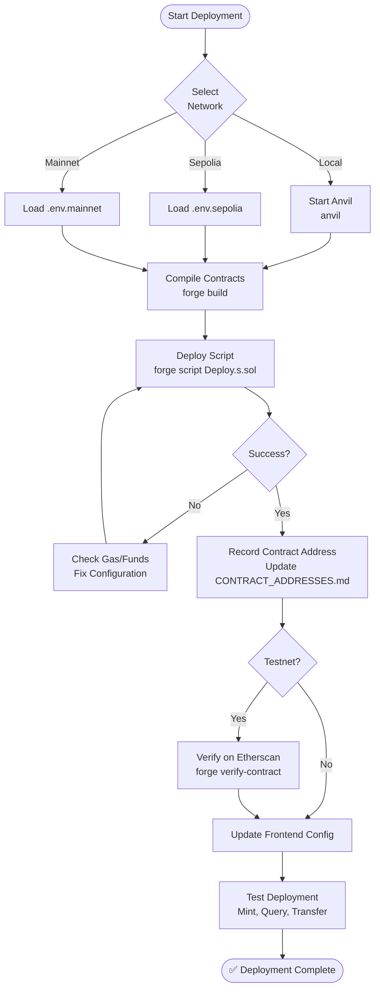

# Deployment Guide

> Step-by-step deployment process for Modular NFT smart contract

## Deployment Pipeline



## Quick Start

### Sepolia Deployment

```bash
# 1. Configure environment
cp .env.sepolia.example .env.sepolia
# Edit: Add your PRIVATE_KEY and RPC_URL

# 2. Deploy
./script/deploy-sepolia.sh

# 3. Verify
forge verify-contract {ADDRESS} ModularNFT --chain sepolia --etherscan-api-key $ETHERSCAN_API_KEY

# 4. Update frontend
# Edit: nft-frontend/lib/contracts/ModularNFT.ts
# Update: CONTRACT_ADDRESSES[11155111] = '{NEW_ADDRESS}'
```

## Environment Configuration

### Sepolia (.env.sepolia)

```bash
SEPOLIA_RPC_URL=https://eth-sepolia.g.alchemy.com/v2/YOUR_API_KEY
PRIVATE_KEY=0x...
ETHERSCAN_API_KEY=YOUR_KEY
COLLECTION_NAME="Modular NFT Collection - Sepolia"
COLLECTION_SYMBOL="MNFT-SEP"
MAX_SUPPLY=100
MINT_PRICE=10000000000000000  # 0.01 ETH
BASE_URI="https://gateway.pinata.cloud/ipfs/"
```

## Deployment Parameters

| Network | Max Supply | Mint Price | Base URI |
|---------|------------|------------|----------|
| Anvil | 100 | 0 ETH | http://localhost:8080/ipfs/ |
| Sepolia | 100 | 0.01 ETH | https://gateway.pinata.cloud/ipfs/ |
| Mainnet | 100 | 0.05 ETH | https://ipfs.io/ipfs/ |

## Post-Deployment

### Update Documentation

1. **CONTRACT_ADDRESSES.md**: Add new address
2. **Frontend config**: Update `CONTRACT_ADDRESSES`
3. **README.md**: Update deployment section
4. **Environment variables**: Update `.env.local`

### Verification

```bash
# Test basic functions
cast call {ADDRESS} "name()" --rpc-url $RPC_URL
cast call {ADDRESS} "totalSupply()" --rpc-url $RPC_URL
cast call {ADDRESS} "owner()" --rpc-url $RPC_URL
```

## Current Deployments

**Sepolia**: `0xd34F288Fa68b657926989EF286477E9f3C87A825` ✅
**Mainnet**: Not deployed

See [CONTRACT_ADDRESSES.md](CONTRACT_ADDRESSES.md) for complete list.

## Related Documentation

- [Contract Addresses](CONTRACT_ADDRESSES.md)
- [Network Configuration](NETWORK_CONFIGURATION.md) *(Phase 2)*
- [Verification Guide](VERIFICATION.md) *(Phase 2)*
