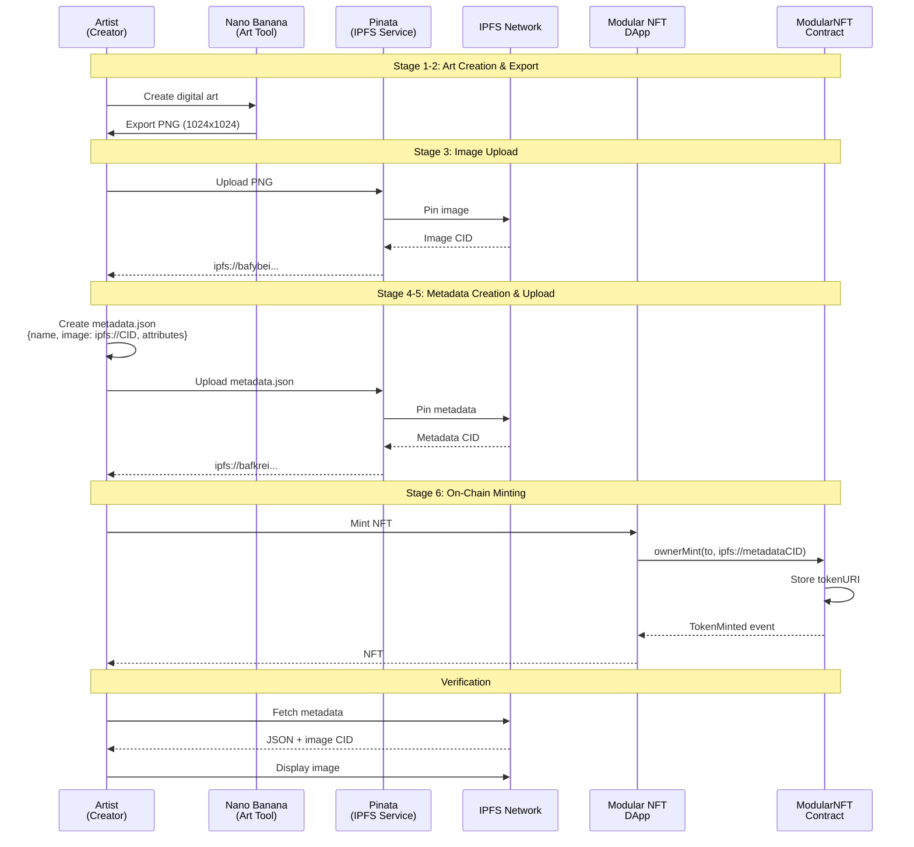

# NFT Asset Creation Pipeline

> Complete workflow: Nano Banana → PNG → Pinata → IPFS → Smart Contract → Marketplace

## Pipeline Overview



## Stage-by-Stage Process

### Stage 1: Digital Art Creation

**Tool**: Nano Banana (or similar vector illustration software)

**Process**:
1. Create coding-themed digital artwork
2. Design with rarity tiers:
   - Common (40%): Basic code elements
   - Rare (30%): Advanced concepts
   - Epic (20%): Complex systems
   - Legend (10%): Ultimate achievements

**Collection**: "Crypto Code Doodles" - 10 unique NFTs

### Stage 2: Export to PNG

**Specifications**:
- Resolution: 1024x1024 pixels
- Format: PNG with transparency
- Color Space: sRGB
- File Size: ~700KB - 2MB

**Output**: `my-nft/photos/*.png`

### Stage 3: IPFS Image Upload (Pinata)

**Manual Process**:
1. Visit [pinata.cloud](https://pinata.cloud)
2. Upload PNG files
3. Receive Image CID (e.g., `bafybeifqclln4pgq5izttyn5bcannbv27bnzmof77d2qig5bx6dipfwbwm`)

**Result**: `ipfs://{ImageCID}`

### Stage 4: Metadata Creation

**ERC-721 Standard JSON**:
```json
{
  "name": "The Red Line #1",
  "description": "A common NFT from the Crypto Code Doodles collection",
  "image": "ipfs://bafybeifqclln4pgq5izttyn5bcannbv27bnzmof77d2qig5bx6dipfwbwm",
  "attributes": [
    {"trait_type": "Rarity", "value": "Common"},
    {"trait_type": "Background", "value": "Green Terminal"},
    {"trait_type": "Doodle", "value": "Console.log"},
    {"trait_type": "Language", "value": "JavaScript"}
  ],
  "external_url": "https://github.com/astierfe/Modular-NFT-Marketplace"
}
```

**Output**: `my-nft/metadata/*.json`

### Stage 5: Metadata Upload

Upload JSON to Pinata → Receive Metadata CID

### Stage 6: On-Chain Minting

**Frontend** (`MintSection.tsx`):
```typescript
// Select image → Auto-populate metadataCID
<SelectImage onImageSelect={(metadataCID) => {
  setTokenURI(`ipfs://${metadataCID}`)
}} />

// Mint transaction
const { mint } = useOwnerMint()
await mint(recipientAddress, `ipfs://${metadataCID}`)
```

**Smart Contract**:
```solidity
function ownerMint(address to, string memory tokenURI) external onlyOwner {
  uint256 tokenId = _tokenCounter;
  _tokenCounter++;
  _safeMint(to, tokenId);
  _setTokenURI(tokenId, tokenURI);  // Stores "ipfs://metadataCID"
  emit TokenMinted(tokenId, to, tokenURI);
}
```

### Stage 7: Marketplace Integration

**External Marketplace**: `0x2AE08980761CB189DA6ca1f89fffD0C6DAD65a8F`

**Trading Flow**:
```typescript
// 1. Approve marketplace
writeContract({
  functionName: 'setApprovalForAll',
  args: ['0x2AE08980761CB189DA6ca1f89fffD0C6DAD65a8F', true]
})

// 2. List on marketplace (external DApp)
// Visit: https://modular-marketplace.vercel.app/marketplace
```

**Royalty**: 5% automatically enforced via EIP-2981

## Current Collection: Crypto Code Doodles

**Total**: 10 NFTs
**Distribution**:
- Common: 4 NFTs (40%)
- Rare: 3 NFTs (30%)
- Epic: 2 NFTs (20%)
- Legend: 1 NFT (10%)

**Contract**: `0xd34F288Fa68b657926989EF286477E9f3C87A825` (Sepolia)
**Max Supply**: 100 NFTs
**Royalty**: 5%

## IPFS Gateways

**Primary**: `https://gateway.pinata.cloud/ipfs/`
**Fallbacks**:
1. `https://ipfs.io/ipfs/`
2. `https://cloudflare-ipfs.com/ipfs/`
3. `https://dweb.link/ipfs/`

## Configuration

**Frontend** (`collectionImages.ts`):
```typescript
export const COLLECTION_IMAGES: CollectionImage[] = [
  {
    id: 1,
    name: "The Red Line #1",
    imageCID: "bafybeifqclln4pgq5izttyn5bcannbv27bnzmof77d2qig5bx6dipfwbwm",
    metadataCID: "bafkreicrfmlctens5kccm5fmggkc6qhnahhv6anxpqn7b7e6lkrl37uq74",
    attributes: { rarity: 'Common', ... }
  },
  // ... 9 more
]
```

## Related Documentation

- [Metadata Standard](METADATA_STANDARD.md) *(Phase 2)*
- [IPFS Integration](IPFS_INTEGRATION.md) *(Phase 2)*
- [Marketplace Integration](../marketplace/MARKETPLACE_INTEGRATION.md) *(Phase 2)*
